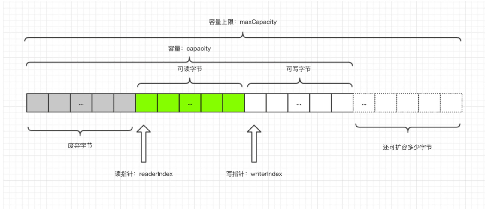

### 一、ByteBuf

#### 1.1 ByteBuf组成
1. ByteBuf由已经丢弃的字节，对应这部分数据是无效的，可读字节，从ByteBuf读取的数据都来自这一部分，最后一部分是可写字节，写入到ByteBuf的数据都会写到这一段，最后虚线部分表示该ByteBuf最多还能扩容多少容量
2. 以上三段内容被两个指针划分出来，从左到右依次是读指针(readerIndex)、写指针(writeIndex)，以及一个变量capacity，表示ByteBuf底层内存的总容量，每读取一个字节，readerIndex自增1，可读（readerIndex-writeIndex）
3. 当向ByteBuf写数据时，如果容量不足，那么这时候可以进行扩容，直到capacity扩容到maxCapacity，超过maxCapacity就会报错